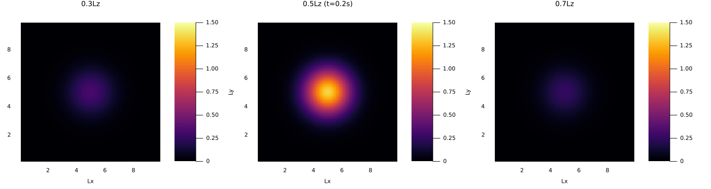
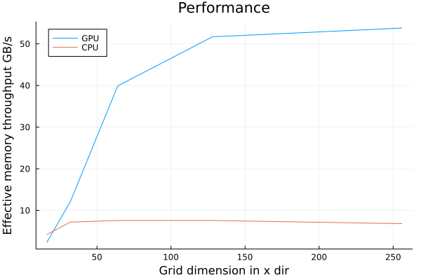
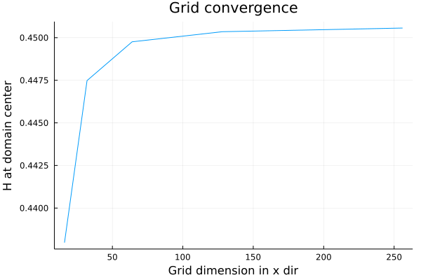
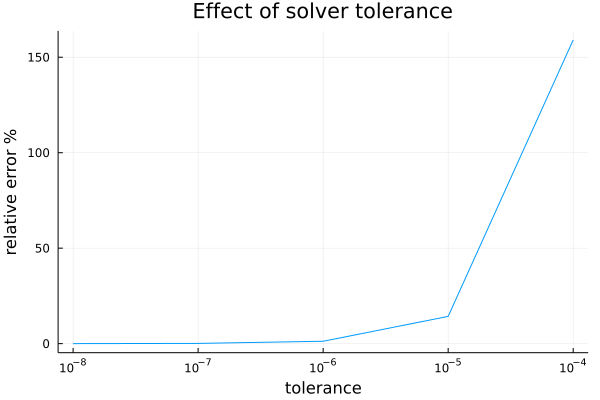

# Part 1: 3D multi-XPUs diffusion solver

💡 Please make sure your browser appearance is in light mode to view the equations properly.

## Introduction
The goal of this part is to solve the 3D linear diffusion equation
</p>
<p align="center">
 
</p>
on GPU/multi-XPUs. The physical problem is defined by the following parameters:

```julia
Lx ,Ly ,Lz  = 10.0, 10.0, 10.0      # domain size
D           = 1.0                   # diffusion coefficient
ttot        = 1.0                   # total simulation time
dt          = 0.2                   # physical time step
```
H is initialized with a Gaussian distribution centered in the domain's center with an amplitute of 2 and standard deviation of 1. Dirichlet boundary conditions H = 0 is enforced at all 6 domain faces.
## Methods
### Numerical discretization
The implicit backward Euler method is used for time integration
</p>
<p align="center">
 
</p>
The above equation is solved using an iterative matrix-free approach: the so called pseudo transient or dual time method. During every physical time step, we argument the system by a numerical/pseudo-transient time integration
</p> 
<p align="center">
 
</p>
And use explicit integration for pseudo time τ
</p>
<p align="center">
 
</p>
Theoretically, if we keep marching in pseudo time, we will end up with a steady state, i.e., H(τ+Δτ)=H(τ)=H(t+Δt). In this case, the quantity in the parentheses of the above equation, also known as residuals, should strictly equal zero. However, we can never reach the true steady state in pratical sense so we move on to the next physical time step until the L2-norm of the residuals is less than a tolerance.

```julia
tol = 1e-8               # tolerance for converging
```

### Multi-XPUs implementation
Packages [ParallelStencil.jl](https://github.com/omlins/ParallelStencil.jl) and [ImplicitGlobalGrid.jl](https://github.com/eth-cscs/ImplicitGlobalGrid.jl) are used for multi-XPUs implementation. The solver is later executed on 4 NVIDIA GeForce GTX TITAN X GPUs. Each GPU has a theoretical peak computation and memory performance of 209.1 [GFlop/s] (double precision) and 336.6 [GB/s].

## Results

### 3D diffusion
The following animation presents the diffusion process at 3 xy planes, located at `z=0.3Lz`, `z=0.5Lz` abd `z=0.7Lz` respectively. 



### Performance
The effective memory performance is evaluated at the end each physical time step using the following metric
</p>
<p align="center">
 
</p>
NIO is the number of memory access of the computed fields H; tit is the execution time of a single pseudo transient iteration. In our case, NIO = 3, including two read access from Ht and Hτ, and one write access to Hτ.

The following figure presents the effective memory performance of CPU/GPU under different grid dimensions, ranging from 16x16x16 to 256x256x256 with a factor of 8.  



Note expect for very small grid size, GPU performces much better than CPU. The optimized performance is achieved at a grid size 256x256x256 with a maximum memory throughput of 53.8 GB/s. If we compare the imbalance between computation and memory access of TITAN X, we get
</p>
<p align="center">
 
</p>
which means we can do 4.97 floating points operation per memory access. For a single pseudo time step, we need 3 times memory access and 10 times operations. Therefore, we are memory bounded.

### Work-precision diagrams
Some further studies are conducted to reduce numerical inaccuracy. First, The below figure depicts convergence upon grid refinement. H value at domain's center is plotted against grid size. It can be concluded that a 128x128x128 is fine enough to produce accurate results.


Second, the effect of tolerance is also investigated. H value at domain's center under different tolerance level are compared against a well-converged solution (with tolerance = 1e-8). As shown in the below figure, a tolerance less than 1e-6 is necessary to get accurate results.




