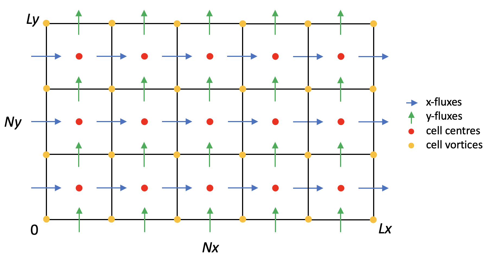
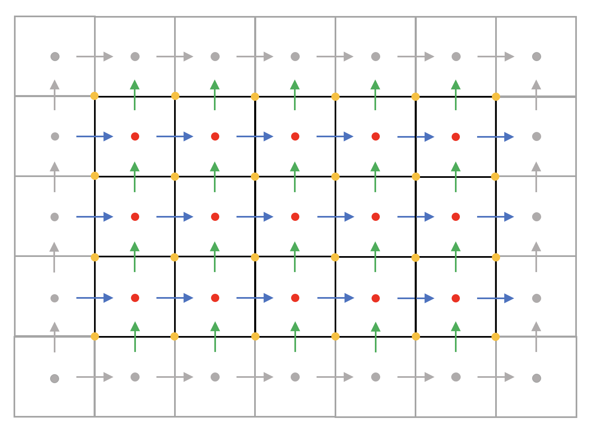
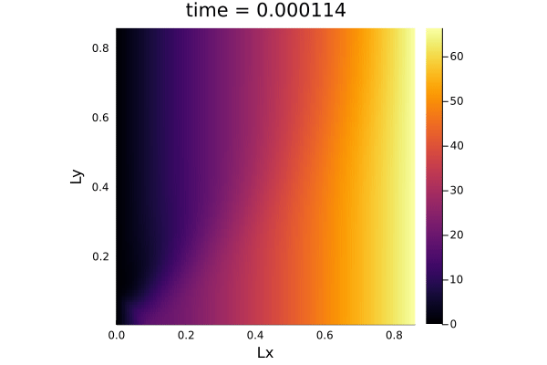
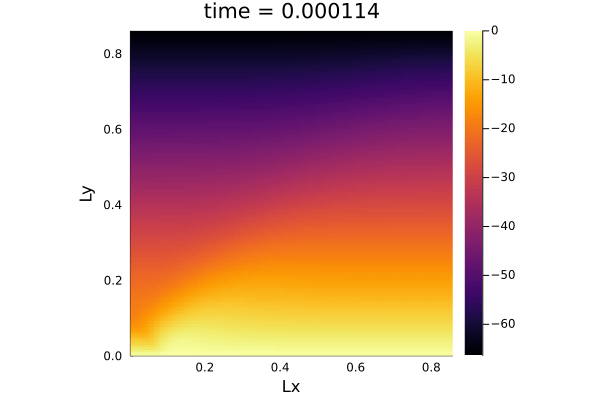
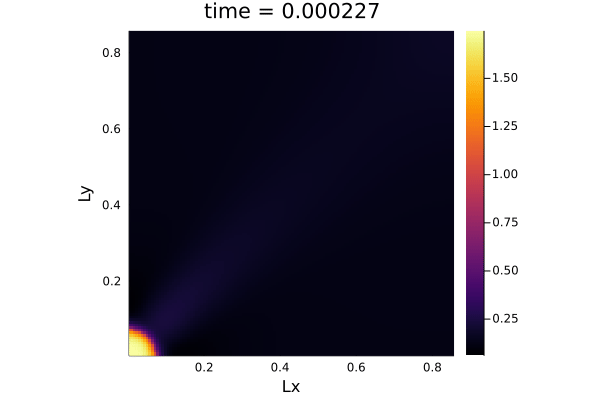

# Part 2: 2D Thermo-Mechanical Coupling

💡 Please make sure your browser appearance is in light mode to view the equations properly.

## Introduction
The goal of this part is to reproduce the solutions of the thermomechanical iteration in slowly creeping incompressible power-law viscous fluids in the absence of buoyancy forces reported in paper [1]. The governing equations, in dimensionless form, are

We follow the same problem definition and boundary conditions detailed in section 4.1 of paper [1]. In short, for x-velocity, we have Dirichlet conditions on left and right boundaries and Neumann conditions (or free-slip boundaries) on top and bottom boundaries; for y-velocity, we have free slip boundaries on left and right boundaries and Dirichlet conditions on top and bottom boundaries; for temperature, Neumann conditions are enforced on all 4 edges to ensure zero heat flux into the domain. 

We developed the solver in two steps: first, built a prototype script to get the physics simulated accurately (`TM_2D_prototype.jl`); second, modified upon the prototype for multi-XPUs execution and better performance (`TM_2D_perf.jl`).

## Methods
### Pseudo Transient Method
The same pseudo-transient method described in part 1 is used here. The governing equations are reformulated by introducing the pseudo time derivatives

An artificial compressibiliy is added to continuity equation, as suggested in [2]. Selection of the pseudo time steps for continuity, momentum and temperature equations can be found in paper [1] (section 3.2). Moreover, we implemented the same relaxation and damping to treat the nonlinear viscosity and speed up the convergence of momentum equations respectively.

### Spatial Discretization
Staggered grid is used to avoid spurious solutions. As shown in the following figure, we have a domain of size (Lx, Ly) with (Nx, Ny) grid cells. Pressure, temperature, normal stress xx and yy components are defined on cell centers; velocities are defined on cell interfaces; shear stress xy component is defined on cell vertices.

In order to treat the Neumann boundary conditions, we expand the grid by two in each dimension. The expanded grid cells are also called ghost cells, depicting in grey in the below figure. The variable values in ghost cells are directly copied from their physical neighbours such that zero derivatives at boundaries are satisfied. The additional merit of defining ghost cells is that they serve as message passing interface in case of multi-XPUs computing.  

## Results

### 2D Thermomechanical coupling
The computational domain is initialized with a pure shear flow and a temperature disturbance at the bottom-left corner. The following animations depict the propagation of x-velocity, y-velocity and temperature respectively (up and right are defined as positive directions for velocities). As time passes, we are evolving towards a steady state where the top-left fluid moves from up to down, and the bottom-right fluid moves from left to right, resulting a strong shear at the domain diagonal. This shear heats up the fluid and that is why we observe a temperature increase along the diagonal.

### Performance

### Work-precision diagrams

## References
\[1\] [T. Duretz, L. Räss, Y.Y. Podladchikov, S.M. Schmalholz (2019). Resolving thermomechanical coupling in two and three dimensions: spontaneous strain localization owing to shear heating. Geophysical Journal International, 216(1), 365-379. doi: 10.1093/gji/ggy434][GJI_19]

\[2\] [A. J. Chorin (1967). A Numerical Method for Solving Incompressible Viscous Flow Problems.Journal of Computational Physics, 135(2), 118-125. doi: 10.1006/jcph.1997.5716][JFC_97]

[GJI_19]: https://academic.oup.com/gji/article-abstract/216/1/365/5140152?redirectedFrom=fulltext
[JFC_97]: https://www.sciencedirect.com/science/article/pii/S0021999197957168